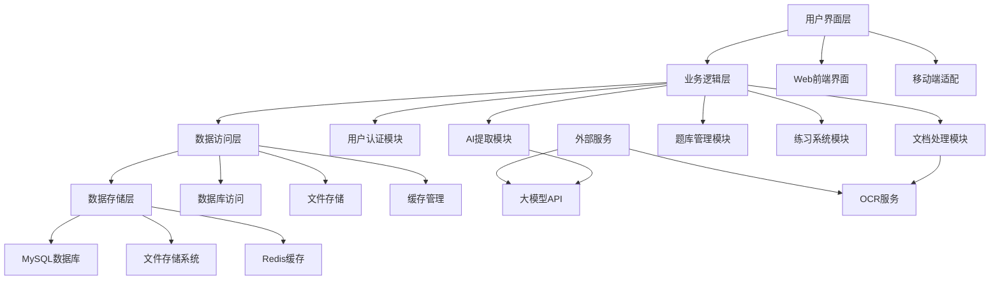
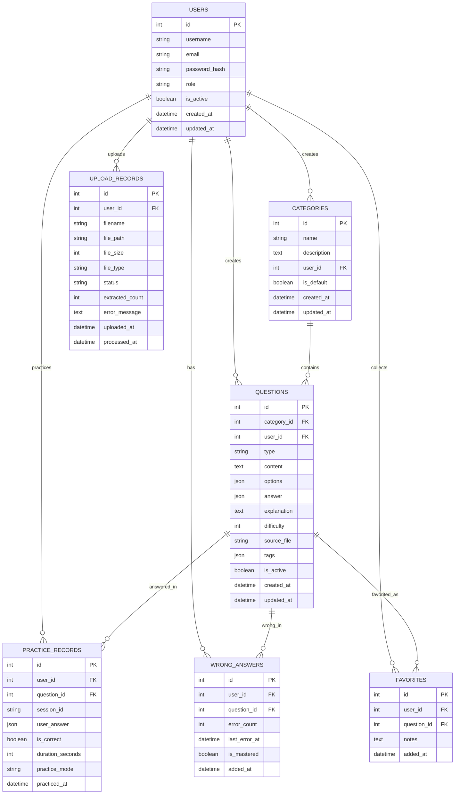
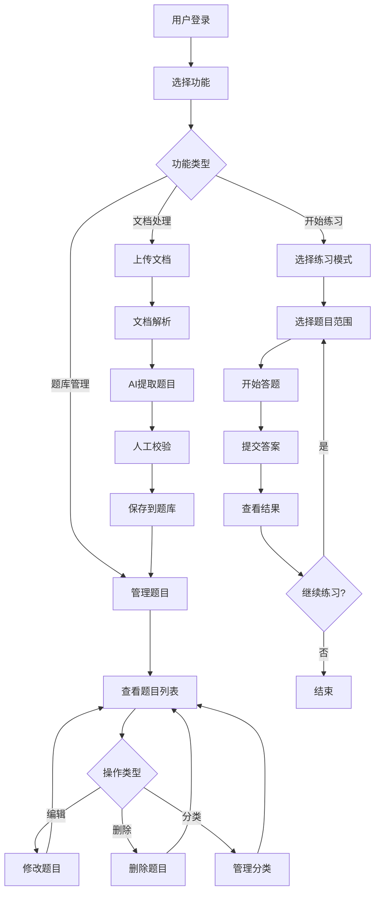
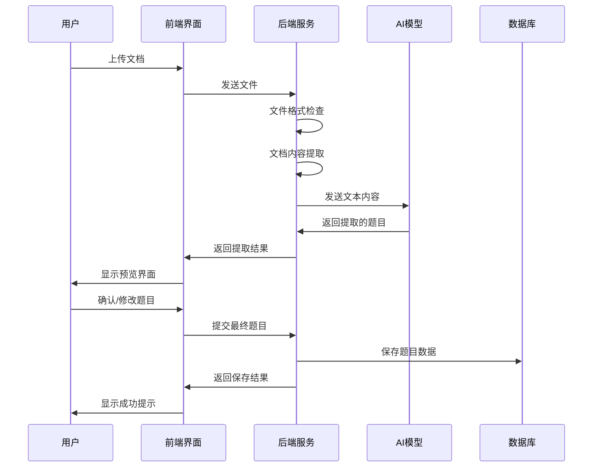
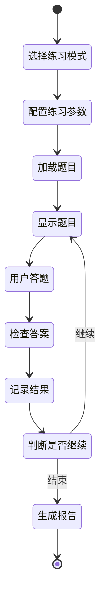
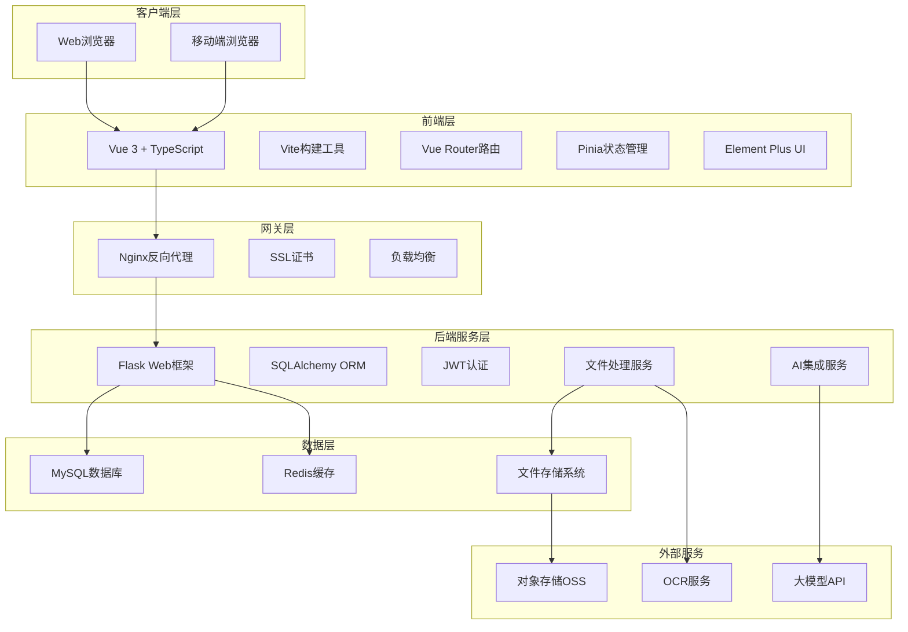
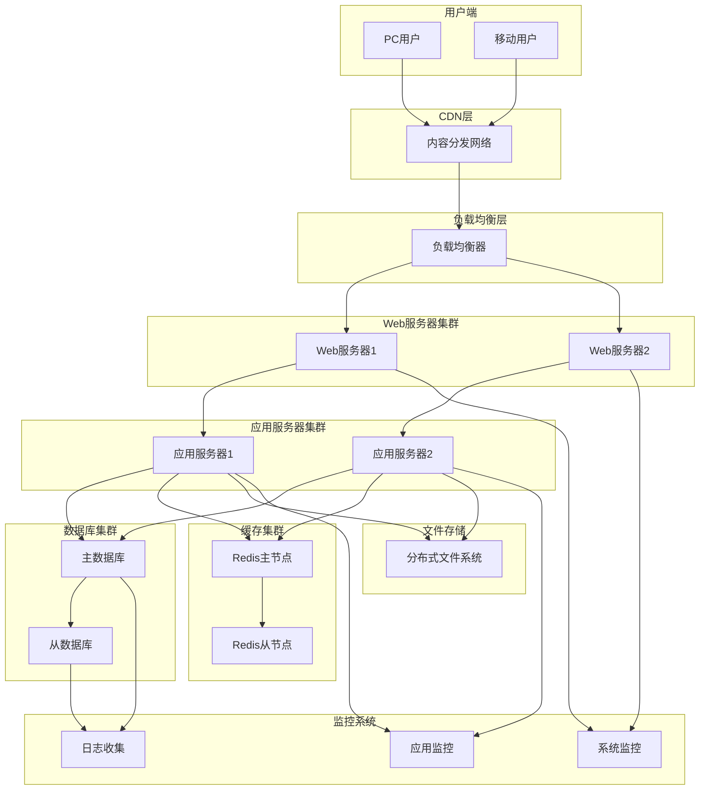
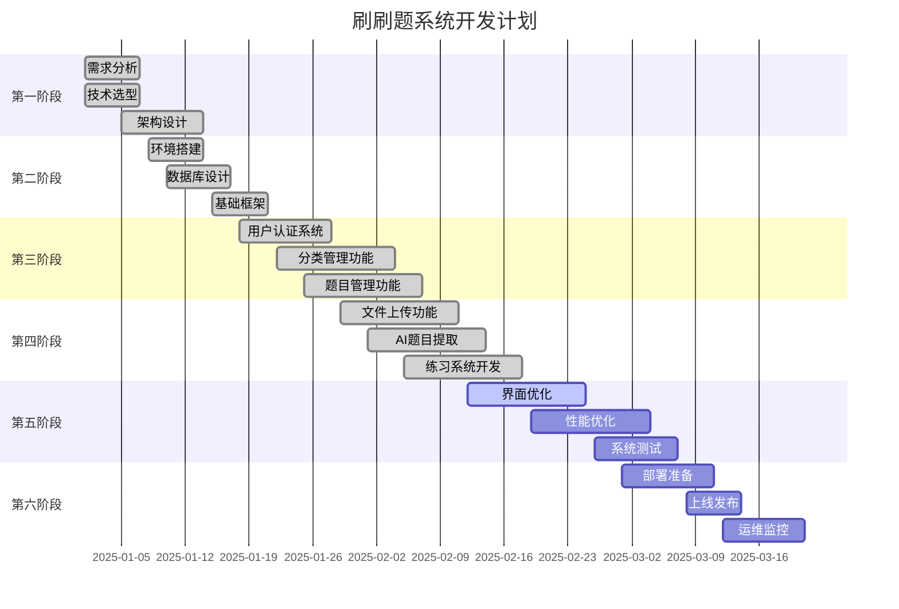
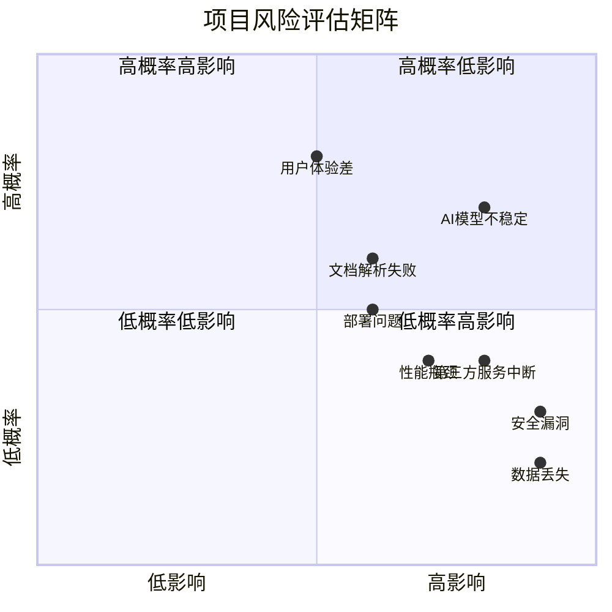
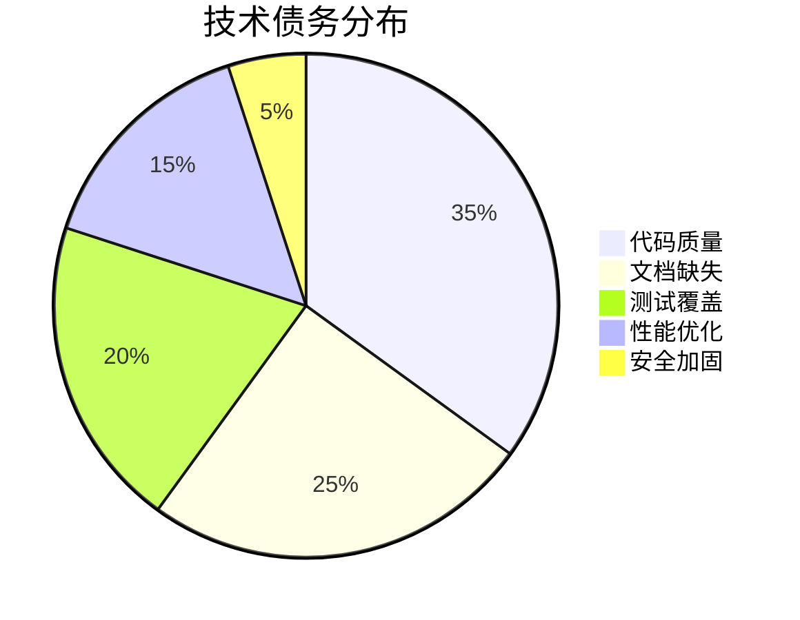

# 刷刷题系统需求分析文档

## 1. 项目概述

### 1.1 项目背景
本项目旨在开发一个智能题库管理与练习系统，通过AI技术自动从各种文档中提取题目，建立个人题库，并提供智能练习功能。系统将支持多种文档格式的题目提取，包括Word文档、PDF文件、图片等，通过大模型技术实现题目的智能识别、分类和结构化存储。

### 1.2 项目目标
- **智能提取**：利用AI技术从文档中自动提取题目和答案
- **题库管理**：建立个人专属的结构化题库系统
- **智能练习**：提供个性化的练习体验和学习建议
- **多格式支持**：支持Word、PDF、图片等多种文档格式
- **用户友好**：提供简洁直观的用户界面和良好的用户体验

### 1.3 系统架构概览



## 2. 数据描述

### 2.1 静态数据

**题目类型定义：**
- **单选题 (single_choice)**：一个正确答案的选择题
- **多选题 (multiple_choice)**：多个正确答案的选择题
- **判断题 (true_false)**：对错判断题
- **填空题 (fill_blank)**：需要填入答案的题目
- **问答题 (essay)**：开放性回答题目

**难度等级：**
- **简单 (1)**：基础概念题
- **中等 (2)**：应用理解题
- **困难 (3)**：综合分析题

### 2.2 动态数据

**用户练习数据：**
- 答题记录和正确率统计
- 错题集合和复习进度
- 学习时间和练习频率
- 知识点掌握程度评估

**系统运行数据：**
- 文档上传和处理状态
- AI提取结果和准确率
- 用户行为和使用统计
- 系统性能和错误日志

### 2.3 数据库设计

本系统将采用关系型数据库（MySQL）进行数据存储，以确保数据的一致性、完整性和支持复杂的关联查询。

#### 2.3.1 数据库ER图



#### 2.3.2 核心数据库表设计

**用户表 (users):**
- id (主键)
- username (用户名，唯一)
- email (邮箱，唯一)
- password_hash (密码哈希)
- role (用户角色：admin/user)
- is_active (账户状态)
- created_at (创建时间)
- updated_at (更新时间)

**分类表 (categories):**
- id (主键)
- name (分类名称)
- description (分类描述)
- user_id (所属用户，外键)
- is_default (是否为默认分类)
- created_at (创建时间)
- updated_at (更新时间)

**题目表 (questions):**
- id (主键)
- category_id (所属分类，外键)
- user_id (创建用户，外键)
- type (题目类型)
- content (题目内容)
- options (选项，JSON格式)
- answer (正确答案，JSON格式)
- explanation (答案解析)
- difficulty (难度等级：1-3)
- source_file (来源文件)
- tags (标签，JSON格式)
- is_active (是否启用)
- created_at (创建时间)
- updated_at (更新时间)

**练习记录表 (practice_records):**
- id (主键)
- user_id (用户ID，外键)
- question_id (题目ID，外键)
- session_id (练习会话ID)
- user_answer (用户答案，JSON格式)
- is_correct (是否正确)
- duration_seconds (答题用时，秒)
- practice_mode (练习模式)
- practiced_at (练习时间)

**错题表 (wrong_answers):**
- id (主键)
- user_id (用户ID，外键)
- question_id (题目ID，外键)
- error_count (错误次数)
- last_error_at (最后错误时间)
- is_mastered (是否已掌握)
- added_at (加入错题集时间)

**收藏表 (favorites):**
- id (主键)
- user_id (用户ID，外键)
- question_id (题目ID，外键)
- notes (个人笔记)
- added_at (收藏时间)

**上传记录表 (upload_records):**
- id (主键)
- user_id (用户ID，外键)
- filename (原始文件名)
- file_path (存储路径)
- file_size (文件大小，字节)
- file_type (文件类型)
- status (处理状态：pending/processing/completed/failed)
- extracted_count (提取题目数量)
- error_message (错误信息)
- uploaded_at (上传时间)
- processed_at (处理完成时间)

### 2.4 数据采集

**文档来源：**
- 用户上传的Word文档 (.docx)
- 用户上传的PDF文件 (.pdf)
- 用户上传的图片文件 (.jpg, .png, .gif)
- 用户上传的纯文本文件 (.txt)
- 用户手动输入的题目

**数据处理流程：**
1. **文件上传验证**：检查文件格式、大小限制
2. **内容提取**：使用相应库提取文档文本内容
3. **AI智能解析**：调用大模型API识别题目结构
4. **数据清洗**：格式化和标准化提取结果
5. **人工校验**：用户确认和修正AI提取结果
6. **数据存储**：将最终题目保存到数据库

## 3. 功能需求

### 3.1 业务流程图

#### 3.1.1 整体业务流程



#### 3.1.2 文档处理流程



#### 3.1.3 练习系统流程



### 3.2 核心功能

#### 3.2.1 文档上传与解析
- **文档上传**：支持拖拽上传、批量上传多种格式文档
- **格式支持**：Word (.docx)、PDF (.pdf)、图片 (.jpg, .png, .gif)、纯文本 (.txt)
- **文档预处理**：自动检测文档编码、格式转换、内容提取
- **进度显示**：实时显示上传和处理进度

#### 3.2.2 智能题目提取
- **AI识别**：利用大模型识别文档中的题目、选项、答案
- **题型分类**：自动识别单选题、多选题、判断题、填空题、问答题
- **结构化处理**：将识别结果转换为结构化数据
- **质量评估**：对提取结果进行质量评分和置信度评估
- **人工校验**：提供界面供用户确认和修正提取结果

#### 3.2.3 题库管理系统
- **分类管理**：支持多级分类，可自定义分类体系
- **题目编辑**：支持题目的增删改查，批量操作
- **标签系统**：为题目添加标签，支持多维度分类
- **搜索功能**：支持关键词搜索、高级筛选
- **导入导出**：支持题库的批量导入导出

#### 3.2.4 智能练习系统
- **练习模式**：顺序练习、随机练习、专项练习、错题练习
- **难度调节**：根据用户表现自动调整题目难度
- **计时功能**：支持限时练习和计时统计
- **答题分析**：详细的答题报告和错误分析
- **学习建议**：基于练习数据提供个性化学习建议

### 3.3 未来增强功能
更多文件格式支持： 扩展支持Excel、纯文本等更多格式的题库文档上传。

智能推荐系统： 基于用户的练习历史和错题情况，智能推荐相关题目和学习内容。

多用户协作： 支持团队共享题库，协作编辑和管理题目。

数据分析与报告： 提供详细的学习数据分析，生成个性化的学习报告和建议。

移动端应用： 开发移动端应用，支持随时随地的学习和练习。

## 4. 性能需求

### 4.1 响应时间要求
- **页面加载时间**：首页加载时间 < 2秒
- **文档上传响应**：文件上传开始响应 < 1秒
- **AI提取处理**：单个文档处理时间 < 30秒
- **题目搜索查询**：搜索结果返回 < 1秒
- **练习答题响应**：答题提交响应 < 0.5秒

### 4.2 并发性能
- **同时在线用户**：支持100个并发用户
- **文件上传并发**：支持10个文件同时上传处理
- **数据库连接**：最大50个并发数据库连接
- **API请求处理**：每秒处理200个API请求

### 4.3 存储容量
- **用户数据存储**：支持10,000个用户账户
- **题目数据存储**：支持100万道题目存储
- **文件存储空间**：支持100GB文件存储
- **数据库大小**：支持10GB数据库容量

### 4.4 可用性要求
- **系统可用性**：99.5%的系统正常运行时间
- **数据备份**：每日自动数据备份
- **故障恢复**：系统故障后1小时内恢复
- **数据一致性**：确保数据的完整性和一致性

## 5. 运行需求

### 5.1 用户界面

#### 5.1.1 设计原则
- **简洁直观**：界面布局清晰，操作流程简单
- **响应式设计**：适配桌面端、平板和移动端
- **一致性**：统一的设计风格和交互模式
- **可访问性**：支持键盘导航和屏幕阅读器

#### 5.1.2 主要界面
- **登录注册页面**：用户身份验证界面
- **主控制台**：系统功能导航和概览
- **文档上传页面**：文件上传和处理状态
- **题目管理页面**：题库浏览、编辑和管理
- **练习界面**：答题和练习功能
- **统计分析页面**：学习数据和进度展示

#### 5.1.3 交互设计
- **拖拽上传**：支持文件拖拽到指定区域上传
- **实时反馈**：操作结果的即时提示和状态更新
- **快捷键支持**：常用功能的键盘快捷键
- **批量操作**：支持题目的批量选择和操作

### 5.2 接口需求

#### 5.2.1 RESTful API设计
- **用户认证接口**：注册、登录、令牌刷新
- **分类管理接口**：分类的增删改查操作
- **题目管理接口**：题目的CRUD操作和搜索
- **文件处理接口**：文件上传、解析和状态查询
- **练习功能接口**：练习会话管理和答题记录
- **统计分析接口**：用户数据统计和报告生成

#### 5.2.2 第三方集成
- **大模型API**：智谱AI、OpenAI等AI服务集成
- **文件存储服务**：云存储服务集成（可选）
- **邮件服务**：用户通知和密码重置邮件
- **监控服务**：系统性能和错误监控

#### 5.2.3 数据格式
- **请求格式**：JSON格式的API请求和响应
- **文件格式**：支持的文档格式和编码
- **数据导出**：JSON、CSV格式的数据导出
- **API文档**：完整的API接口文档和示例

## 6. 其他需求

### 6.1 系统稳定性
- **错误处理**：完善的异常捕获和错误提示机制
- **数据验证**：输入数据的格式和有效性验证
- **事务管理**：数据库操作的事务一致性保证
- **日志记录**：详细的系统操作和错误日志

### 6.2 可维护性
- **代码规范**：统一的编码标准和注释规范
- **模块化设计**：清晰的模块划分和接口定义
- **版本控制**：Git版本管理和分支策略
- **文档完整**：技术文档、API文档和用户手册

### 6.3 安全性
- **身份认证**：JWT令牌认证和会话管理
- **数据加密**：敏感数据的加密存储和传输
- **访问控制**：基于角色的权限管理
- **安全防护**：SQL注入、XSS攻击等安全防护

### 6.4 扩展性
- **水平扩展**：支持多服务器部署和负载均衡
- **功能扩展**：模块化架构支持新功能添加
- **数据库扩展**：支持数据库分库分表
- **API扩展**：RESTful API支持版本管理

## 7. 开发路线与技术方案概述

### 7.1 技术架构图

#### 7.1.1 系统整体架构



#### 7.1.2 部署架构图



### 7.2 开发路线

#### 第一阶段：基础架构搭建（第1-2周）
- 环境配置和项目初始化
- 数据库设计和创建
- 基础API框架搭建
- 前端基础页面框架

#### 第二阶段：核心功能开发（第3-5周）
- 用户认证系统
- 文档上传和解析功能
- AI题目提取集成
- 题库管理功能

#### 第三阶段：练习系统开发（第6-7周）
- 练习模式实现
- 答题界面开发
- 结果统计和分析
- 错题管理功能

#### 第四阶段：优化和部署（第8周）
- 性能优化
- 用户体验改进
- 系统测试
- 部署上线

### 7.3 后端技术方案
**技术栈选择：**
- **开发语言：** Python 3.9+
- **Web框架：** Flask 2.3+
- **数据库ORM：** SQLAlchemy 2.0+
- **数据库：** SQLite（开发）/ MySQL（生产）
- **认证系统：** JWT (PyJWT)
- **文档处理：** python-docx, PyPDF2, Pillow
- **AI集成：** 智谱AI GLM-4, OpenAI API
- **任务队列：** Celery + Redis（可选）

**架构设计：**
- 采用MVC架构模式，分离业务逻辑和数据访问
- RESTful API设计，支持前后端分离
- 模块化设计，便于功能扩展和维护
- 统一的错误处理和响应格式
- 完善的日志记录和监控机制
- 实现统一的错误处理和日志记录

### 7.4 前端技术方案
**技术栈选择：**
- **当前实现：** 原生HTML + CSS + JavaScript
- **计划升级：** Vue 3 + TypeScript + Vite
- **UI框架：** Bootstrap 5（当前）/ Element Plus（计划）
- **状态管理：** Pinia（计划）
- **路由管理：** Vue Router 4（计划）
- **HTTP客户端：** Axios
- **构建工具：** Vite（计划）

**当前实现状态：**
```
前端/
├── index.html          # 主页面
├── styles/
│   └── main.css       # 样式文件
└── js/
    ├── main.js        # 主控制器
    ├── auth.js        # 认证管理
    ├── categories.js  # 分类管理
    ├── questions.js   # 题目管理
    ├── practice.js    # 练习功能
    └── upload.js      # 文件上传
```

**升级计划：**
```
前端/
├── src/
│   ├── components/    # Vue组件
│   ├── views/         # 页面视图
│   ├── router/        # 路由配置
│   ├── stores/        # Pinia状态管理
│   ├── utils/         # 工具函数
│   └── types/         # TypeScript类型定义
├── public/            # 静态资源
└── package.json       # 依赖配置
```

### 7.5 部署与运维方案
**部署方案：**
- **生产部署：** 云服务器 + Nginx + Gunicorn
- **开发部署：** 本地开发服务器
- **数据库：** MySQL 8.0+（生产）/ SQLite（开发）
- **缓存：** Redis 6.0+（可选）
- **文件存储：** 本地存储 / 云存储OSS（可选）

**运维监控：**
- **应用监控：** 日志记录和错误追踪
- **性能监控：** 响应时间和资源使用监控
- **数据备份：** 定期数据库备份和恢复测试
- **安全防护：** HTTPS、防火墙、访问控制
- **错误追踪：** 统一异常处理和错误日志

## 8. 项目管理与风险控制

### 8.1 项目里程碑甘特图



### 8.2 风险评估矩阵



### 8.3 技术债务管理



## 9. 附录

### 9.1 技术调研

#### 9.1.1 大模型选择对比

| 模型 | 优势 | 劣势 | 适用场景 |
|------|------|------|----------|
| GPT-4 | 理解能力强，准确率高 | 成本较高，API限制 | 高质量题目提取 |
| Claude | 安全性好，逻辑清晰 | 访问限制，成本高 | 复杂题目分析 |
| 文心一言 | 中文支持好，成本适中 | 技术相对较新 | 中文题目处理 |
| 智谱GLM | 开源友好，成本低 | 性能相对较弱 | 预算有限场景 |

#### 9.1.2 文档解析技术对比

| 技术方案 | 支持格式 | 准确率 | 开发难度 |
|----------|----------|--------|----------|
| python-docx | Word文档 | 高 | 低 |
| PyPDF2 | PDF文档 | 中 | 中 |
| OCR + AI | 图片、扫描件 | 中 | 高 |
| 综合方案 | 多格式 | 高 | 中 |

### 9.2 开发规范

#### 9.2.1 代码规范
- **Python代码**：遵循PEP 8规范
- **JavaScript代码**：遵循ESLint标准
- **API设计**：遵循RESTful设计原则
- **数据库命名**：使用下划线命名法

#### 9.2.2 Git工作流
- **主分支**：main（生产环境）
- **开发分支**：develop（开发环境）
- **功能分支**：feature/功能名称
- **修复分支**：hotfix/问题描述

#### 9.2.3 测试规范
- **单元测试**：覆盖率不低于80%
- **集成测试**：核心功能必须测试
- **性能测试**：关键接口响应时间<2s
- **安全测试**：SQL注入、XSS等安全检查

### 9.3 项目里程碑

| 里程碑 | 时间节点 | 关键交付物 | 验收标准 |
|--------|----------|------------|----------|
| M1: 架构搭建 | 第2周末 | 基础框架 | 前后端通信正常 |
| M2: 核心功能 | 第5周末 | MVP版本 | 基础功能可用 |
| M3: AI集成 | 第6周末 | 智能提取 | AI提取准确率>80% |
| M4: 系统完善 | 第7周末 | 完整系统 | 所有功能正常 |
| M5: 上线部署 | 第8周末 | 生产系统 | 系统稳定运行 |

---

**文档版本：** v2.0  
**创建时间：** 2025年1月  
**最后更新：** 2025年1月（规范化更新）  
**文档状态：** 已完成并规范化  